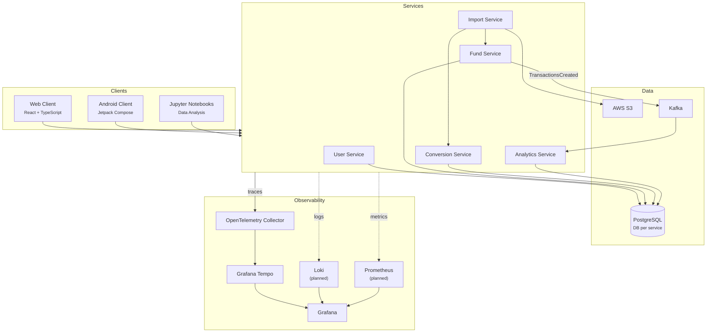

# Funds

A personal financial management platform for budgeting and investment tracking, built with Kotlin microservices and Kotlin Multiplatform clients.

## Overview

Funds is a full-stack application designed to manage personal finances across multiple accounts, funds, and currencies. It handles transaction imports from bank exports, currency and instrument conversions, analytics, and reporting — providing a unified view of spending, income, and investment performance.

The project is built around a microservices architecture with event-driven communication, a shared Kotlin Multiplatform SDK serving Android, web, and data analysis clients, and a full observability stack for distributed tracing.

## Tech Stack

| Layer | Technologies |
|---|---|
| **Language** | Kotlin 2.1, TypeScript |
| **Backend** | Ktor, Netty, Koin, kotlinx.serialization |
| **Database** | PostgreSQL, Exposed ORM, Flyway, HikariCP |
| **Messaging** | Apache Kafka |
| **Client (Shared)** | Kotlin Multiplatform (JVM, Android, JS) |
| **Android** | Jetpack Compose, Material 3, Navigation Compose |
| **Web** | React 18, TypeScript, Tailwind CSS, Recharts |
| **Observability** | OpenTelemetry, Grafana Tempo, Grafana |
| **Testing** | JUnit 5, TestContainers, MockServer, AssertJ |
| **Infrastructure** | Docker Compose, LocalStack (S3) |
| **Build** | Gradle with Kotlin DSL, convention plugins, version catalog |

## Architecture



### Key Architectural Decisions

- **Database per service** — each service owns its schema and data, enabling independent evolution and clear domain boundaries.
- **Event-driven analytics** — the analytics service subscribes to Kafka events from the fund service rather than polling, decoupling read-heavy analytics from transactional workloads.
- **Shared platform module** — cross-cutting concerns (tracing, serialization, database configuration, error handling) are extracted into a shared `platform-jvm` module, eliminating duplication across services.
- **Kotlin Multiplatform SDK** — a single client SDK codebase is shared across Android, web, and JVM notebook clients with platform-specific HTTP engines.
- **Convention plugins** — Gradle build logic is standardized through custom convention plugins, ensuring consistent configuration across all modules.

## Project Structure

```
funds/
├── service/
│   ├── user/           # User management
│   │   ├── user-api
│   │   ├── user-sdk
│   │   └── user-service
│   ├── fund/           # Accounts, funds, transactions
│   │   ├── fund-api
│   │   ├── fund-sdk
│   │   └── fund-service
│   ├── conversion/     # Currency & instrument conversions
│   ├── import/         # Data import orchestration
│   └── analytics/      # Event-driven analytics
├── client/
│   ├── client-sdk/     # Kotlin Multiplatform SDK (JVM, Android, JS)
│   ├── android-client/ # Native Android app
│   ├── web-client/     # React + TypeScript frontend
│   └── notebook/       # Jupyter notebooks for data analysis
├── platform/
│   ├── platform-api/       # KMP common types
│   ├── platform-jvm/       # Shared backend infrastructure
│   └── platform-jvm-test/  # Test utilities with TestContainers
└── infra/local/        # Docker Compose for local development
```

Each backend service follows a consistent **api / sdk / service** module pattern: the `api` module defines models, the `sdk` provides a typed client for other services to consume, and the `service` module contains the implementation.

## Getting Started

### Prerequisites

- JDK 21+
- Docker & Docker Compose

### Start Infrastructure

```bash
cd infra/local
docker-compose up -d postgres kafka otel-collector tempo grafana
```

This starts PostgreSQL (port 5438), Kafka (port 9092), and the observability stack (Grafana on port 3030).

### Build & Run Services

```bash
# Build everything
./gradlew build

# Build and install a specific service (build + maven local + docker image)
./gradlew :service:fund:fund-service:installLocal

# Run all services via Docker Compose
cd infra/local && docker-compose up
```

### Run the Web Client

```bash
./gradlew :client:client-sdk:build :client:web-client:jsBrowserDevelopmentRun
```

### Run Tests

```bash
# All tests
./gradlew test

# Tests for a specific module
./gradlew :service:fund:fund-service:test
```

Integration tests use TestContainers to spin up real PostgreSQL and Kafka instances — no mocks for infrastructure dependencies.

## Data Analysis

The project includes a notebook client module for Jupyter-based data analysis. It connects to the running services via the shared SDK, enabling exploration of expenses, income, investments, and provisions.
