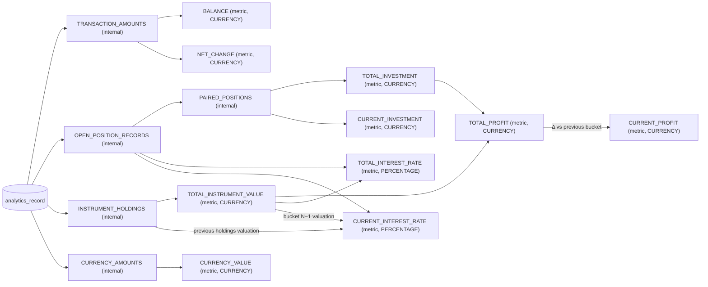

# Series Resolution

Analytics reports are resolved through a dependency graph of **series** — bucketed time series on a shared
clock. A series is a value of the sealed domain hierarchy `Series<T : SeriesSlice>`, whose type parameter is
its per-bucket slice type. **Metrics** (`Series.Metric`) are the external scalar series: they carry their
`MetricTO` API mapping with a unit (`CURRENCY` or `PERCENTAGE`) and are what users request. Internal series
(`Series.Internal<T>`) produce intermediate slices (records, unit amounts, dated cash flows) and are not
addressable through the API.

Resolution is **progressive**: every node emits one `Previous` seed (its pre-interval state) followed by
exactly one slice per interval bucket, in order — the *bucket-clock invariant*, owned by the engine.
Dependents consume dependency slices as they are emitted, so buckets flow through the graph without waiting
for upstream series to complete.

A request carries a list of **queries**, each with a client-supplied id, a metric, and its own
`QueryContext` (grouping + filter); interval, granularity, and target currency are request-level and shared
by every query. A resolution node is identified by `(series, projected context)`: each query's context
propagates unchanged down its dependency closure, and the node key projects it onto the dimensions the
series is *effectively* sensitive to — its own declared `contextSensitivity` unioned with its dependency
closure's; filters are set-based, so semantically equal filters compare equal by construction. Queries whose projected
contexts collide share the node's single resolution through the existing shared-flow machinery; e.g. the
grouping-insensitive `OPEN_POSITION_RECORDS`/`PAIRED_POSITIONS` chain runs once per distinct filter no
matter how many groupings consume it. Every definition declares its sensitivity explicitly
(`ContextDimension.ALL` unless it genuinely ignores a dimension) — over-declaring only duplicates work,
under-declaring shares nodes whose outputs differ and yields wrong numbers.

## Components

- `SeriesBucketResolver<T>` — the uniform resolver contract: `resolvePrevious(previous)` + `resolveBucket(bucket,
  inputs)`, with dependencies delivered as aligned same-bucket slices regardless of count. Each definition's
  resolver is a private nested `inner` class; dependencies are named once as constants in the definition's
  `companion object Dependencies` (e.g. `AMOUNTS = Series.TransactionAmounts`), referenced by both the
  `dependencies` list and the resolver's typed slice accesses (`inputs[AMOUNTS]`), so declared and accessed
  dependencies cannot drift. Dependency access is same-bucket only; anything cross-bucket (running balances,
  accumulated positions, previous valuation) is private accumulator state inside the resolver. Instances are
  created per node via `createResolver(context)` — a `SeriesResolutionContext` bundling the shared request
  fields (user, interval, target currency) with the node's projected `QueryContext` — so state is
  node-confined within the request.
- `SeriesDefinition<T>` — binds a `Series<T>` to its dependency list, its `contextSensitivity`, and its
  resolver factory; app-scoped collaborators (repository, conversions) are constructor state on the
  definition and reach the resolver through the outer scope.
- `SeriesRegistry` — all definitions, validated at startup: dependencies registered, graph acyclic, no
  duplicates. The registry assembly in `config/AnalyticsDependencies.kt` additionally requires every
  `Series.entries` value to have a definition (catalog completeness).
- `MetricResolutionService` — the planner: topo-sorts each query's closure, keys node flows by
  `(series, projected context)` so colliding nodes are wired once, drives each node's resolver over a zip of
  its dependencies' flows, shares every node's flow with lazy full replay (resolve-once under fan-out,
  deadlock-free diamonds), one coroutine per node inside a per-request `coroutineScope` (first failure —
  shared node or not — cancels the whole graph, all queries included). Buckets are strictly sequential within
  a node; concurrency comes from independent branches and pipeline skew. `resolveFlow(request)` exposes the
  per-bucket event stream tagged with query ids — the SSE endpoint (`POST .../metrics/stream` in
  `MetricsApiRouting`) forwards it frame by frame as `buckets`/`value`/`complete`/`error` events;
  `resolve(request)` collects it into a `MetricResolutionReport` keyed by query id, zero-backfilling groups
  that first appear mid-interval.
- Domain types (`Series`, `SeriesSlice`, `SeriesEmission`, `SeriesBucketResolver`, `QueryContext`,
  `SeriesResolutionContext`, `MetricResolutionRequest/Report`, grouping helpers) live in
  `ro.jf.funds.analytics.service.domain`.

## Series graph

Leaf series are the only nodes reading the repository, each with a query scoped to the transaction/unit
types its consumers need:

| Leaf | Query filter | Slice |
|---|---|---|
| `TRANSACTION_AMOUNTS` | none (all records, SQL-aggregated) | `SeriesSlice.Amounts` |
| `OPEN_POSITION_RECORDS` | `OPEN_POSITION` (raw records) | `SeriesSlice.Records` |
| `INSTRUMENT_HOLDINGS` | `OPEN/CLOSE_POSITION` + `INSTRUMENT` units | `SeriesSlice.Amounts` |
| `CURRENCY_AMOUNTS` | `CURRENCY` units | `SeriesSlice.Amounts` |

`PAIRED_POSITIONS` pairs the currency and instrument records of each `OPEN_POSITION` transaction by
`transactionId` into dated cash flows (historical-cost conversion happens at each position's date).

## Adding a metric

1. Add the value to `MetricTO` (analytics-api) with its unit type and a `Series.Metric` data object in `Series`.
2. Create a `SeriesDefinition` in this package, depending on existing series where possible.
3. Register it in the registry assembly (`config/AnalyticsDependencies.kt`) — startup validation enforces the
   registry matches `Series.entries`.
4. Add a display label in the web client's `metricLabels` map (`AnalyticsPage.tsx`).
